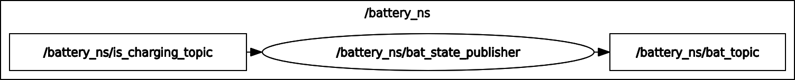

# Battery State Publisher Node



This ROS 2 package simulates a battery state publisher node that models the behavior of a battery. The battery can be charged or discharged based on certain parameters, and its state is published periodically.
## Instructions for Building and Running
- Clone the Repository:
    ```
  git clone https://github.com/emirhancibir/bat_state_ros2.git
  ```
- Build the ROS 2 Package:
    ```
  colcon build --packages-select battery_state
  ```
- Source the ROS 2 Workspace:
  ```
  source install/setup.bash
  ```
- Run the Launch File:
  ```
  ros2 launch battery_state battery_state_launch.py
  ```
- Publish Charging Status:
  Open a new terminal and publish charging status (true or false) to the topic:
  ```
  ros2 topic pub --once  /battery_ns/is_charging_topic std_msgs/msg/Bool "data: false"
  ```
  Change false to true to simulate charging.

## Parameters
### The battery state publisher node accepts the following parameters:
- x (int): Rising time in seconds.
- y (double): Rising coefficient for charging
- z (int): Falling time in seconds.
- w (double): Falling coefficient for discharging.
You can modify these parameters in the launch file (battery_state_launch.py) as needed.

## BatteryState Message
The power_msg/msg/BatteryState.msg file defines the message structure used for publishing the battery state. It includes the following fields:
- name (string): Name of the battery.
- charge_level (float32): Charge level of the battery as a percentage.
- is_charging (bool): Indicates whether the battery is currently charging.
- total_capacity (float32): Total capacity of the battery.
- current_capacity (float32): Current capacity of the battery
- battery_voltage (float32): Voltage of the battery.
- supply_voltage (float32): Voltage of the supply breake
- charger_voltage (float32): Voltage of the charger.

## Behavior
- When charging is true and the current capacity is less than the total capacity, the battery is charged. The charging process follows the specified rising time (x) and rising coefficient (y).
- When discharging is true and the current capacity is greater than 30.0, the battery is discharged. The discharging process follows the specified falling time (z) and falling coefficient (w).
- The battery state is published periodically, and additional messages are published when the battery is fully charged or discharged.
Feel free to experiment with different parameter values to observe how the battery state changes based on the charging and discharging coefficients.
  
